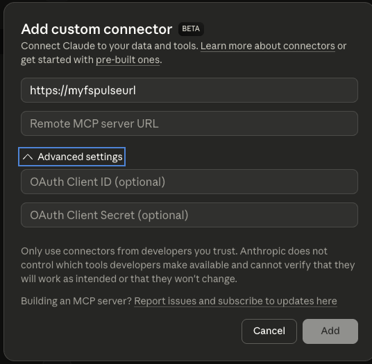

# Setup (Experimental)

> **Experimental:** MCP support in fsPulse is experimental. The connection methods described below each have known limitations that are under active investigation. You may need to restart fsPulse or your client if connectivity issues occur.

## Enable the MCP Server

The MCP server is disabled by default. Enable it in the fsPulse Settings page under **MCP Server (Experimental)**, or add the following to your `config.toml`:

```toml
[mcp]
enabled = true
```

Restart fsPulse after changing this setting. You should see `MCP server enabled at /mcp` in the startup output.

## Choosing a Connection Method

There are three ways to connect an AI client to fsPulse's MCP server. Each has different tradeoffs and known issues:

| Method | Client | Requires Proxy | Multi-Chat | Setup Effort |
|--------|--------|---------------|------------|--------------|
| [Custom Connector](#claude-desktop-custom-connector) | Claude Desktop | Yes (HTTPS) | Yes | Medium |
| [Developer Config](#claude-desktop-developer-config) | Claude Desktop | No | No | Low |
| [Claude Code](#claude-code) | Claude Code | No | Yes | Low |

**Multi-Chat** means multiple chat sessions can use the MCP server at the same time.

## Claude Desktop (Custom Connector)

This is the recommended approach for Claude Desktop. It uses Claude's native Custom Connector feature to connect directly to fsPulse over HTTPS, allowing every chat session to communicate with the MCP server independently.

**Requirement:** Custom Connectors require an HTTPS URL. Since fsPulse serves HTTP, you need a reverse proxy that terminates TLS in front of fsPulse. Any reverse proxy that supports TLS will work, including [Caddy](https://caddyserver.com/), [nginx](https://nginx.org/), or [Traefik](https://traefik.io/).

### Setting up a reverse proxy (Caddy example)

[Caddy](https://caddyserver.com/) is the simplest option because it automatically provisions locally-trusted TLS certificates. After [installing Caddy](https://caddyserver.com/docs/install), create a `Caddyfile`:

```
https://localhost:8443 {
    reverse_proxy localhost:8080
}
```

Run `caddy run` (or `caddy start` to run in the background). Caddy will generate a certificate trusted by your system, so Claude Desktop will accept the connection without errors.

> **Note:** Replace `8080` with your fsPulse port if you changed it, and `8443` with whatever HTTPS port you prefer.

### Adding the connector in Claude Desktop

1. Open Claude Desktop and go to **Settings > Connectors** (not Developer settings).
2. Scroll to the bottom and click **Add custom connector**.
3. Enter the HTTPS URL of your reverse proxy (e.g., `https://localhost:8443/mcp`).
4. Leave the OAuth fields blank (fsPulse does not require authentication).
5. Click **Add**.



fsPulse should now appear as an available connector in all of your Claude Desktop chat sessions.

## Claude Desktop (Developer Config)

This approach uses the Developer settings JSON config with [mcp-remote](https://www.npmjs.com/package/mcp-remote) as a stdio-to-HTTP bridge. It requires no reverse proxy but has a significant limitation: **only one chat session at a time can use the MCP server**. Starting a new chat will not have access to fsPulse's tools until you restart Claude Desktop.

Open Claude Desktop's configuration file by going to **Settings > Developer** (under "Desktop app") and clicking **Edit Config**. Add an entry under `mcpServers`:

```json
{
  "mcpServers": {
    "fspulse": {
      "command": "npx",
      "args": [
        "mcp-remote",
        "http://localhost:8080/mcp"
      ]
    }
  }
}
```

Restart Claude Desktop. fsPulse should appear as an available MCP server in the first chat session you open.

> **Why the single-chat limitation?** The Developer config only supports stdio-based MCP servers. The `mcp-remote` bridge runs as a single subprocess that holds one HTTP session with fsPulse. Only the chat session that first initializes this connection can use it.

## Claude Code

Claude Code supports Streamable HTTP natively, with no bridge or proxy required. Each conversation gets its own independent session. Add to your `.mcp.json`:

```json
{
  "mcpServers": {
    "fspulse": {
      "type": "streamable-http",
      "url": "http://localhost:8080/mcp"
    }
  }
}
```

## Multiple Instances

You can connect to multiple fsPulse instances by giving each a unique name. This example uses the Developer Config approach, but the same idea applies to Custom Connectors and Claude Code:

```json
{
  "mcpServers": {
    "fspulse-local": {
      "command": "npx",
      "args": ["mcp-remote", "http://localhost:8080/mcp"]
    },
    "fspulse-remote": {
      "command": "npx",
      "args": ["mcp-remote", "http://my-server:8080/mcp"]
    }
  }
}
```

Reference a specific instance by name in your prompts:

> Show me the integrity report on fspulse-remote
